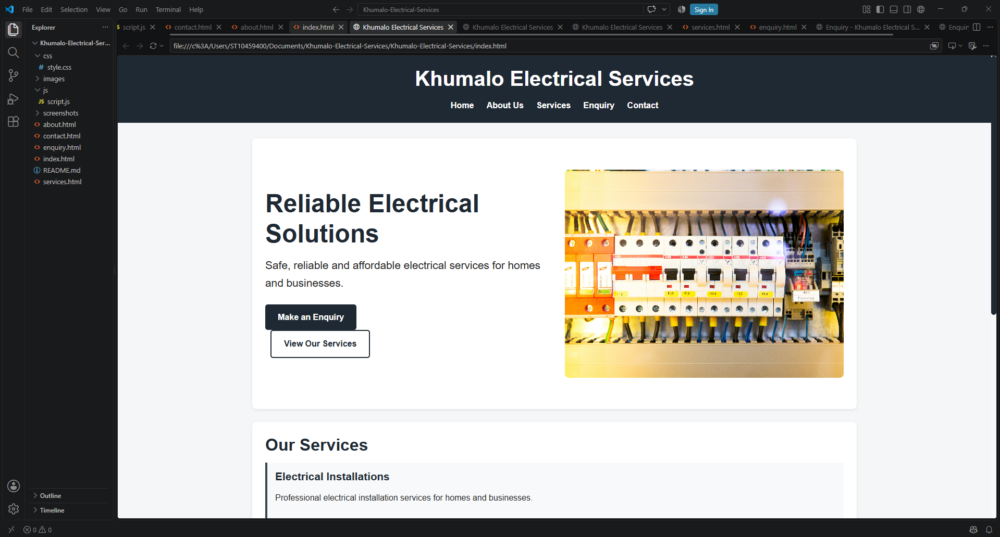
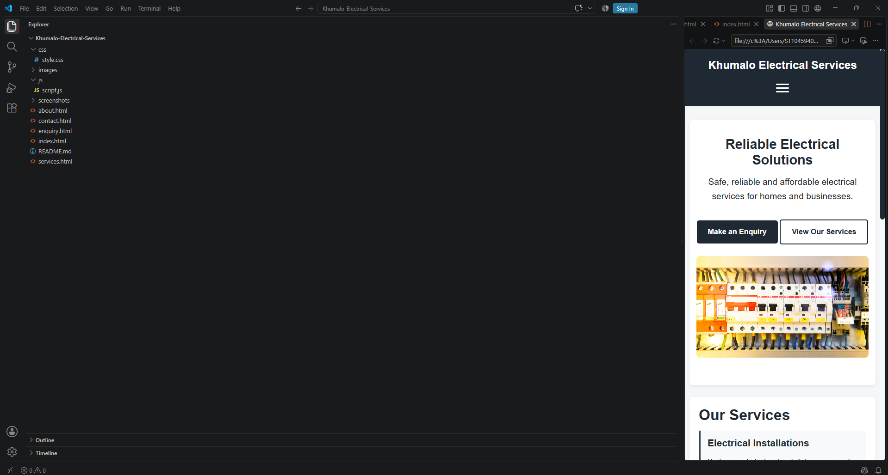

# Khumalo Electrical Services Website

## Project Description

This project is a website developed for Khumalo Electrical Services, a South African electrical services business. The website provides information about the business, its electrical services, contact details, and allows potential customers to submit an enquiry.

The purpose of the website is to provide an online presence for the business and make it easier for customers to learn about its services and request assistance.

## Website Features

- Five-page website consisting of Home, About Us, Services, Enquiry, and Contact pages.
- Navigation menu allowing users to move easily between all pages.
- Information about Khumalo Electrical Services and the services offered.
- Electrical service cards displaying the different services provided.
- Images related to electrical services.
- Enquiry form allowing users to enter their contact details and service requirements.
- Required field validation to prevent incomplete form submissions.
- JavaScript functionality that displays a confirmation message after an enquiry is submitted.
- Responsive design to improve usability on different screen sizes.

## Technologies Used

- HTML5 – Used to create the structure and content of the website.
- CSS3 – Used to style the website, including the layout, colours, spacing, and responsive design.
- JavaScript – Used to add functionality to the enquiry form and display a confirmation message after submission.
- Visual Studio Code – Used as the code editor to develop the website.

## Website Pages

The website consists of the following pages:

- **Home (`index.html`)** – Introduces Khumalo Electrical Services and provides an overview of the business.
- **About Us (`about.html`)** – Provides information about the business, including its mission and vision.
- **Services (`services.html`)** – Displays the electrical services offered by the business.
- **Enquiry (`enquiry.html`)** – Allows users to submit an enquiry and select the service they require.
- **Contact (`contact.html`)** – Provides the business contact information and operating hours.

## File Structure

```text
Khumalo-Electrical-Services
│
├── css
│   └── style.css
│
├── images
│   ├── electrician.jpg
│   └── electrical-repair.jpg
│
├── js
│   └── script.js
│
├── index.html
├── about.html
├── services.html
├── enquiry.html
├── contact.html
└── README.md
```

## How to Run the Website

1. Download or clone the Khumalo Electrical Services project.
2. Open the project folder in Visual Studio Code.
3. Open `index.html`.
4. Open the website using a web browser or Live Server.
5. Use the navigation menu to access the other pages.

## Changelog

### Version 1.0 – Initial Project Setup
- Created the Khumalo Electrical Services project folder.
- Created the initial HTML file structure.
- Added the Home, About Us, Services, Enquiry, and Contact pages.

### Version 1.1 – Navigation and Content
- Added a navigation menu linking all five website pages.
- Added relevant content about Khumalo Electrical Services.
- Added information about the electrical services offered.

### Version 1.2 – Styling and Design
- Added CSS styling to improve the layout and appearance of the website.
- Styled the navigation, buttons, content sections, forms, and footer.
- Added responsive design to improve usability on different screen sizes.

### Version 1.3 – Images and Functionality
- Added images related to electrical services.
- Added an enquiry form for users to submit their details and service requirements.
- Added required field validation to the form.

### Version 1.4 – JavaScript Functionality
- Added JavaScript to handle the enquiry form submission.
- Added a confirmation message after a successful form submission.
- Added functionality to reset the form after submission.

### Version 1.5 – Documentation and Final Improvements
- Added comments to the HTML, CSS, and JavaScript code.
- Created the website sitemap.
- Added project documentation to the README.
- Organised the final project files and folder structure.

## Author

Student Name: Your Actual Full Name  
Student Number: Your Actual Student Number  
Module: Web Development (Introduction)  
Module Code: WEDE5020  
Institution: The Independent Institute of Education 

## Project Information

This website was developed as Part 1 of the Web Development (Introduction) project. The project involves the planning, design, development, and documentation of a website for Khumalo Electrical Services.
---

## Part 2: CSS Styling and Responsive Design

### Overview
Part 2 focused on styling the website using CSS and making it fully responsive across desktop, tablet, and mobile devices. An external stylesheet (`css/style.css`) was created and linked to all HTML pages. The design uses a professional colour scheme (dark navy and gold) appropriate for an electrical services company.

### Key Features Implemented
- **External CSS Stylesheet:** Linked to all 5 HTML pages
- **CSS Reset:** Consistent styling across all browsers
- **Colour Variables:** Centralised colour scheme using CSS custom properties
- **Typography:** Consistent heading and paragraph styling
- **Navigation:** Styled navbar with hover effects and active states
- **Hamburger Menu:** Mobile navigation with JavaScript toggle
- **Hero Section:** Two-column responsive layout on desktop
- **Service Cards:** Styled with shadows, borders, and hover effects
- **Buttons:** Primary and secondary button styles with hover animations
- **Forms:** Styled inputs, labels, and buttons with focus states
- **Footer:** Consistent styling across all pages

### Responsive Design
The website adapts to three main breakpoints:

| Device | Screen Width | Layout |
|--------|-------------|--------|
| Mobile | < 768px | Single column, hamburger menu |
| Tablet | 768px - 991px | Two columns, full navigation |
| Desktop | 992px+ | Three columns, spacious layout |

### Screenshots

#### Desktop View


#### Tablet View


#### Mobile View


### Changelog

#### Version 2.0 - Part 2 Implementation (2026-09-16)
- **Created external stylesheet** (`css/style.css`) and linked to all pages
- **Implemented CSS reset** for cross-browser consistency
- **Defined colour variables** for the brand palette (navy blue and gold)
- **Styled typography** with consistent heading and paragraph hierarchy
- **Built responsive navigation** with hover effects and focus states
- **Added hamburger menu** for mobile devices with JavaScript toggle
- **Designed hero section** with two-column grid layout on desktop
- **Styled service cards** with shadows, borders, and hover animations
- **Created button styles** (primary, secondary, outline) with transitions
- **Styled forms** with focus states and validation feedback
- **Added media queries** for tablet (768px) and desktop (992px) breakpoints
- **Implemented pseudo-classes** (`:hover`, `:focus`, `:active`, `:valid`, `:invalid`)
- **Added responsive images** using `srcset` and `sizes` attributes
- **Fixed HTML structure** to support two-column hero layout
- **Tested on desktop, tablet, and mobile** using browser resizing

#### Version 1.1 - Part 1 Feedback Implementation (2026-09-15)
- Reviewed and implemented Part 1 feedback
- Fixed HTML structure for hero section
- Verified all navigation links work correctly
- Updated README with project documentation

#### Version 1.0 - Part 1 Completion (2026-08-13)
- Created all 5 HTML pages (index, about, services, enquiry, contact)
- Set up file and folder structure (css, js, images)
- Implemented navigation across all pages
- Added content for each page
- Set up enquiry form with basic validation
- Initialised GitHub repository

### References

**Images:**
- Electrician image: [Pexels](https://www.pexels.com/) - Free to use stock photo
- Electrical repair image: [Pexels](https://www.pexels.com/) - Free to use stock photo

**Learning Resources:**
- MDN Web Docs. 2026. *CSS: Cascading Style Sheets*. [Online]. Available at: https://developer.mozilla.org/en-US/docs/Web/CSS [Accessed 16 September 2026].
- MDN Web Docs. 2026. *Responsive Design*. [Online]. Available at: https://developer.mozilla.org/en-US/docs/Learn/CSS/CSS_layout/Responsive_Design [Accessed 16 September 2026].
- W3Schools. 2026. *CSS Media Queries*. [Online]. Available at: https://www.w3schools.com/css/css_rwd_mediaqueries.asp [Accessed 16 September 2026].
- W3Schools. 2026. *CSS Flexbox*. [Online]. Available at: https://www.w3schools.com/css/css3_flexbox.asp [Accessed 16 September 2026].
- W3Schools. 2026. *CSS Grid*. [Online]. Available at: https://www.w3schools.com/css/css_grid.asp [Accessed 16 September 2026].